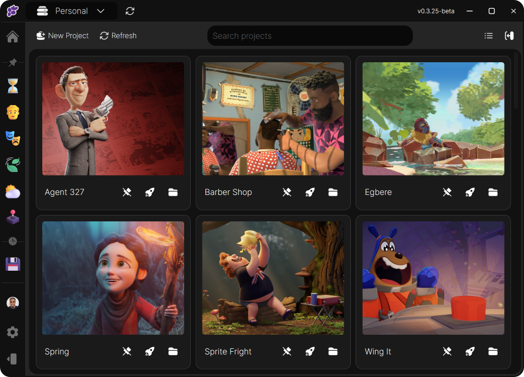

# Clustta - Open-source version control, collaboration and asset management for creative work

## Overview

Creative projects - especially collaborative ones like animation, design, and asset creation require more complex workflows than just files and folders. Teams need to version large assets, track who's working on what, roll back mistakes, and stay in sync. The tools that exist today force a choice: developer focused version control that's too complicated for art-based teams, or consumer file sync that's too fragile to trust with production work.

Clustta is an open-source version control and asset management platform built specifically to fill this gap. It merges the intentional version control of Git/GitHub with the simplicity of file sharing platforms.

## The Problem

Git can't check out a single file without cloning the entire repo - impractical when assets are very large. Perforce and SVN work but arent as user friendly(besides the $$$). Google Drive and Dropbox autosync and this can corrupt project files.

## Approach

With Clustta, the goal is to take the best of both worlds - the robustness of real version control and the accessibility of consumer file sharing - and build something that actually fits creative work.

We're building with some critical pillars in mind:

- **Modern and artist first** - A user interface designed for artists, not engineers. No branches/merge conflicts/terminal commands etc. Save, version, and share in a simple UI.
- **Fast and efficient** - Clustta chunks assets when creating checkpoints - meaning that only the changed parts of a file are stored and transferred.
- **Open source** - The client and studio server are open source. Studios can audit the code, contribute improvements, and avoid vendor lock-in.
- **Local-first, distributed, and privacy-centric** - Projects live on your machine first. Sync happens when you choose and to a server you control. Self-hosted and air-gapped deployments are first-class.

## Evolution

Work on Clustta has spanned over five years, shaped by hands-on experience running [Eaxum](https://eaxum.com), an animation studio. The journey started after watching Blender Studio's pipeline breakdowns - we adopted SVN locally, then built **Nagato**, a Blender addon powered by PySVN. Nagato worked with an internal tool called **Genesys** that could populate Blender files from parameters, automating scene setup.

But we kept running into the same problem: what about everything that isn't a `.blend` file? Textures, rigs, storyboards, renders - they all needed versioning too. The choice was either build plugins for every DCC tool we used, or consolidate everything into one standalone app.

We chose the latter. The first iteration was built with **Electron**, still backed by SVN. We then moved to **Tauri** after researching backup systems like [Rustic](https://github.com/rustic-rs/rustic) - its content-addressable storage model directly influenced our chunking approach. Finally, we settled on **Wails** (Go + Vue), because the server-side work we were doing alongside the client made a consolidated Go codebase far more practical than maintaining separate languages across the stack.

## Architecture

Under the hood, Clustta uses content-addressed chunking - only the changed chunks of a file are stored and transferred, not whole files. This makes versioning large binary assets more efficient.

The system is made up of two components:

- **[Client](https://github.com/eaxum/clustta-client)** - A cross-platform desktop app (Windows, macOS, Linux) built with Go and Vue 3 via Wails. This is how artists interact with their projects. 
- **[Studio Server](https://github.com/eaxum/clustta-studio)** - A self-hostable team server that coordinates project sync, collaboration, and studio-level access control. One per studio. 

We also offer a managed hosting option.

Projects are stored as `.clst` SQLite databases containing all metadata - collections, assets, checkpoints, tags, roles, and sync state. For local/offline users and self-hosted studios, file chunks are also stored directly inside the SQLite database, making each project a self-contained archive that can be read anywhere. The idea is to bundle metadata with the binary data in a compressed state.

## Features

### Checkpoints & Versioning
Every saved version of an asset is a **checkpoint** - a lightweight snapshot that records the file's content hash, size, author, timestamp, and a comment. File data is chunked using FastCDC and compressed with Zstandard, so only the delta is stored and transferred on each version.

### Collections & Organization
Assets are organized into **collections** - nestable, folder-like containers with their own types, descriptions, and preview images. Collections can be marked as **libraries** (shared asset containers) and support hierarchical paths. Both collections and assets can be assigned custom **types** with icons, giving teams full control over how their project taxonomy looks and behaves.

### Tagging
Assets can be tagged with user-defined labels for filtering and organization. Tags are first-class objects synced across all collaborators.

### Assignments & Status Tracking
Assets and collections can be **assigned** to specific users (with both an assignee and an assigner tracked). Assets carry a **status** (e.g., Todo, In Progress, Review, Done). Custom status names, colors, and short names are planned but not yet configurable. 

### Dependencies
Assets can declare **dependencies** on other assets or collections, with configurable dependency types. This makes it possible to express relationships and to trace said relationships across the project. When an asset is assigned to a user, all of its dependencies are resolved recursively - including entire collections of textures, typefaces, or other supporting files - so the assignee gets everything they need to work.

### Workflows
Clustta includes a visual **workflow editor** where studios can define pipeline templates. A workflow specifies the collections, asset slots, and links between them - essentially a blueprint for how a shot, sequence, or asset should be structured. New work can then be scaffolded from these workflows.

### Asset Templates
**Asset Templates** are predefined file starters - a studio/team can register a base `.blend`, `.ma`, or `.psd` file as a template and use it when creating new assets, ensuring consistent starting points across the team.

### Selective Sync & Conflict Resolution
Sync is user-triggered, not automatic. Artists push and pull when they choose, which means no one's stable working version gets quietly overwritten. Checkouts are selective - users really only get what's assigned to them and this triggers a soft lock. You can only create checkpoints on assets assigned to you.

When conflicts arise - a collection with the same name and parent, or an asset with the same name, folder, and extension already exists on the server - Clustta surfaces them explicitly with two resolution options:

- **Rename** - Keep the local item but give it a new name. It syncs as a separate entity.
- **Merge** - Combine the local item with the server's existing one. Local checkpoints are preserved and uploaded as new versions, so no work is lost.

### Collaboration & Roles
Studios and projects support multiple collaborators with role-based access control. Roles are fully customizable with granular permissions covering collections, assets, templates, checkpoints, assignments, user management, status changes, and dependency management. Project owners can add collaborators and control what each role is allowed to do.

### Studios & Team Management
Studios are team-level organizations. Each studio has its own server, user roster, roles, and project catalog. Studios support two hosting modes:

- **Dedicated** - A studio server running on the team's own infrastructure (or a provisioned VM).
- **Cloud** - A managed instance hosted by Clustta

### Sharing
Collaborators can create **shareable download links** for specific checkpoints - time-limited URLs that let external stakeholders grab approved files without needing a Clustta account or project access (Like WeTransfer).

### Trash & Recovery
Deleted collections, assets, templates, and checkpoints are moved to trash rather than permanently removed, allowing recovery of accidentally deleted work. Permanent deletion is deferred until the next sync or until the trash is actively cleared.

### Ignore Patterns
Clustta supports ignore rules (similar to `.gitignore`) for excluding files from versioning. Built-in ignore lists exist for engine-specific files - for example, the Unreal Engine ignore list filters out intermediate build artifacts, saved caches, and IDE metadata that have no place in version control.

### Integrations

#### Kitsu (CGWire)
Clustta integrates with [Kitsu](https://www.cg-wire.com/kitsu), the open-source production tracking tool from CGWire. Studios can link a Clustta project to a Kitsu project, mapping collections and assets to their Kitsu counterparts. This allows production tracking metadata (statuses, assignments) to stay in sync between the two systems. An optional Kitsu `Category` metadata column can place assets in an additional collection level during import.

#### DCC Bridge
The client ships with a local HTTP bridge server that exposes project data (accounts, studios, projects, assets, checkpoints) as REST endpoints. This lets DCC tools - Blender, Maya, Unreal, or any tool that can make HTTP calls - query and interact with Clustta projects programmatically, enabling plugin development without coupling to the desktop app's internals.

### AI Agent
Clustta also includes a built-in conversational **AI assistant** that understands the project's structure. It can list collections, query assets, look up users and statuses, and answer questions about the project - backed by a curated knowledge base of Clustta's concepts. Users plug in their own API key and choose from supported providers: OpenAI, Anthropic, Google Gemini, Groq, and Ollama (local).

### Search
Full-text search across assets, collections, and tags within a project.

## Deployment

Studio servers ship as Docker containers. See the [Studio Server repo](https://github.com/eaxum/clustta-studio) for full deployment instructions.

## Quick Start

For installation and setup instructions, see the [Installation Guide](Installation.md).

## Development

For detailed development environment setup and deployment instructions, see the [Development Guide](Installation.md#development-setting-up-and-running-the-environment).

## Documentation

For further information about features and usage, see the [Documentation](https://docs.clustta.com).

## Contributing

There are many ways to contribute to Clustta - reporting bugs, improving documentation, submitting code, or helping spread the word. See the [Contributing Guide](Contributing.md) for details.

## Acknowledgments

Special thanks to **Francesco Siddi** ([Blender Studio](https://studio.blender.org)) and **Frank Rousseau** ([CGWire](https://www.cg-wire.com) / [Kitsu](https://www.cg-wire.com/kitsu)) for their support, guidance, and mentorship through Clustta's development.

## License

Clustta is released under the GNU Affero General Public License v3.0. See the [LICENSE](LICENSE) file for details.

## About

Clustta is developed by [Eaxum](https://eaxum.com), a computer animation studio based in Nigeria.

</a>
